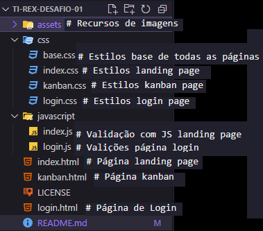

# TI-REX-Desafio-01

Projeto de Desafio trilha front-End React da CompassUol. Estre projeto se trata de uma site simples de 3 páginas com HTML CSS e Javascript para validações

## 🛠️ Construído com

Mencione as ferramentas que você usou para criar seu projeto

- HTML - Usado para estruturação do site
- CSS - Para estilização do site
- Javascript - Para validações de campos com Regex

## 📄 Estrutura das Páginas

1. **index**: Landing page com informações gerais.
2. **login**: Formulário de login com validação de e-mail.
3. **kanban**: Área de acesso a aplicação apos login.

## 📁 Estrutura do Projeto

Esta estrutura foi utilizada vizando uma menor repetição de codigos entre as páginas.

## ✒️ Autores

Projeto construido por:

- **Mahavishnu Jneesh** - _Desenvolvedor_ - [Front-End](https://github.com/MVISHNU-BR)

## 📄 Licença

Este projeto está sob a licença MIT License - veja o arquivo [LICENSE.md](https://github.com/MVISHNU-BR/TI-REX-Desafio-01/blob/master/LICENSE) para detalhes.

## 🔧 Melhorias Futuras

- Revisar responsividade completa.
- Implementar notificações apos validações.

---

⌨️ com ❤️ por [Mahavishnu Jneesh](https://github.com/MVISHNU-BR) 😊
